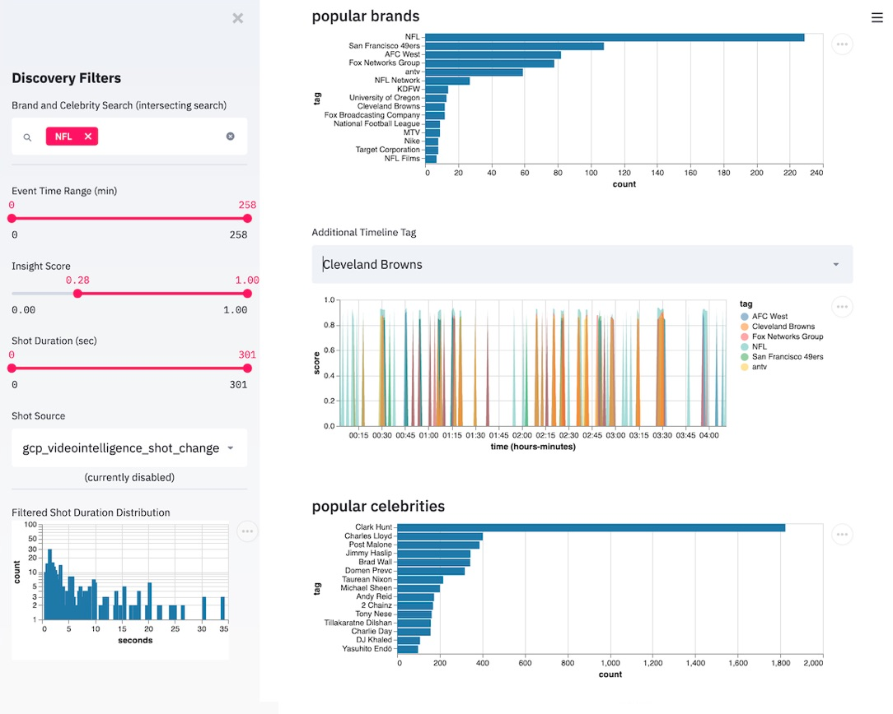

# Metadata Flattening Service Explorer

An interactive [streamlit](https://www.streamlit.io/) app for exploration of 
analytics events flattened with this package.

1. [Getting Started](#getting-started)
2. [Execution](#execution-and-deployment)
3. [Future Development](#future-development)

# Getting Started

This wev app runs in python via a light-weight wrapper and the streamlit 
package. It has the capability to show these event insights out-of-the-box.

* select by score/confidence
* select by time/position in an asset or duration of containing shot
* show the top N tags for a filtered set
* show a time line of top M tags for a filtered set (plus an additional user-input/search)
* a free form dataframe exploration tool

At this time there are no run-time options and the app will auto-load
with a few assumptions.


figure: demo interface reviewing a recent popular football game


## Installation

To install dependencies, just run the following.  This will insert streamlit
and a few processing librarieis in your environment.

```shell
pip install -r requirements.txt
```

The application does use [spaCy](https://spacy.io/) for some basic NLP tasks, 
so after the above installation, run the command below to get the right pre-built
model.

```shell
python -m spacy download en_core_web_sm
```

# Execution and Deployment

To execute, you will need to bring your own pre-processed flattened metadata and
specifically place them into the `../results` directory.

* Currently, the app expects these to be installed a directory called `results` 
  in the parent of this directory (e.g. ../results).  It also expects these files
  to be `.csv` or `.csv.gz` and the output of the `main.py` script in the 
  parent directory.  
* Upon completion of [data ingestion](#Data-Ingest), the application will
  create a compressed data file in this directory.  If you delete this file or the directory
  is not accessble, the app may not function properly or will need to regenerate it.

*NOTE* All input files (by file extension) under the `results` directory will be 
ingested, so make note that only relevant file from a single asset are included.

To execute, change to this directory and run the below command.

```shell
streamlit run timed.py
```

## Data Ingest

For speedier interactions, a one-time data ingest process will begin.  Depending
on the length of your asset (almost linearly), the code will proceed to
load all flattened files, convert time signatures, and perform some basic NLP
tasks.  

*On a 2.9 GHz 8-core, this process took about 7 minutes for an asset 2.75 hours long with 10 event input files. (v0.3.0)* 

Once complete, a cached ingested data file will be created and stored
as [described above](#Execution-and-Deployment).

## Datafile Warning

I'm seeing a strange warning like this, what gives? *(added v0.3.1)*

```shell
Warning: Using datafile data_bundle.49212d06.pkl.gz with no grounded reference. Version skew may occur.
```

You're running with a precomputed/cached data file but the source data wasn't available to check against.
A simple way to get past it is just refresh the web page, but you should note that it means some
code may have changed (possibly resulting in an app breakage) between the live and historical versions.

# Future Development

Although there is no specific timeline for deliverables, this is a potential
roadmap for future features to be implemented.

* search - search for favorite items via text or celebrity
* media connectivity - link to play videos or show images at specific time points
* instances - scatter plots for infrequent but notable events, like celebrities
* HUD - creation of sparklines or overlays with events of all types co-visualized
* tech debt - speed up the ingest and processing steps
