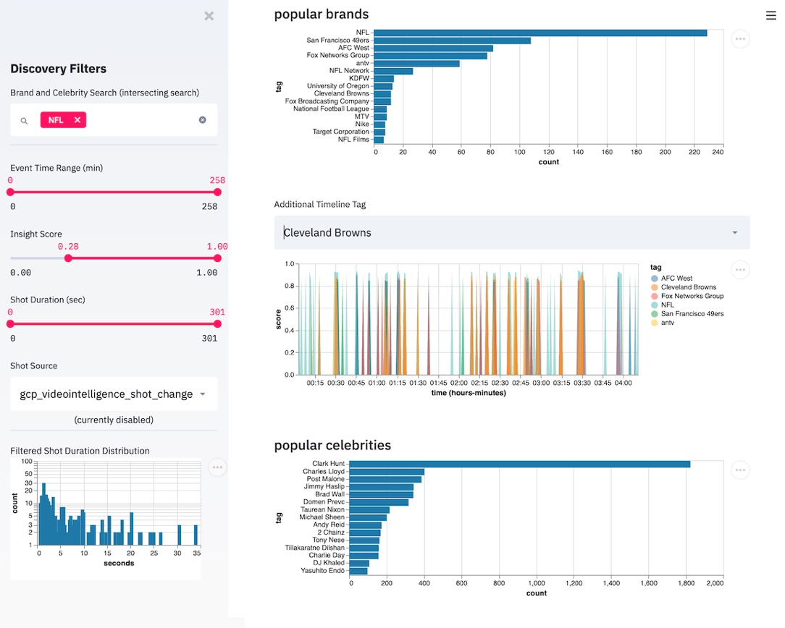

Metadata Flattening Service Explorer
====================================

An interactive metadata browser application has been created for exploring metadata
in a proof-of-concept fashion.

- Metadata Browser

    ... is an interactive `streamlit <https://www.streamlit.io/>`__ app for
    exploration of analytics events flattened with this package starting
    from `flattened metadata <README.md>`__.

    1. `Getting Started <#getting-started-browser>`__
    2. `Browser Execution <#browser-execution-and-deployment>`__
    3. `Future Browser Development <#future-browser development>`__

Getting Started Browser
=======================

This web app runs in python via a light-weight wrapper and the streamlit
package. It has the capability to show these event insights
out-of-the-box.

-  select by score/confidence
-  select by time/position in an asset or duration of containing shot
-  show the top N tags for a filtered set
-  show a time line of top M tags for a filtered set (plus an additional
   user-input/search)
-  a free form dataframe exploration tool

At this time there are no run-time options and the app will auto-load
with a few assumptions.

|Explorer Demo Image| figure: demo interface reviewing a recent popular
football game

Installation
------------

To install dependencies, just run the following. This will insert
streamlit and a few processing librarieis in your environment.

.. code:: shell

   pip install -r app/browse/requirements.txt

The application does use `spaCy <https://spacy.io/>`__ for some basic
NLP tasks, so after the above installation, run the command below to get
the right pre-built model.

.. code:: shell

   python -m spacy download en_core_web_sm  (this vocab is small and does not provide vocabulary)
   python -m spacy download en_core_web_lg  (this vocab is larger and provides vocabulary that can be used elsewhere)

The application can also generate small clips from an original video.
For now, this is accomplished with a system call to ``ffmpeg``, so to
use this functionality you must have it installed on your system.
Historically, the `anaconda framework <https://www.anaconda.com/>`__ has
been a great way to get `ffmpeg as a
package <https://anaconda.org/menpo/ffmpeg>`__ working in various
environments. Future versions may attempt to reduce this burden this via
python package dependency.

.. code:: shell

   conda install ffmpeg

Static File Serving
-------------------

Files like the input data and created data from the tables can be made
accessible with a modification to the streamlit package *(added v0.9.4)*.  
While this is not an ideal solution, it is currently listed as one example 
within a streamlit 
`issue solution <https://github.com/streamlit/streamlit/issues/400>`_.

A helper script ``static_link_create.py`` in the application directory can be
executed to create a symbolic link.  
This helper script is executed within the docker creation script of the application's
docker image.

**NOTE: This utility was not tested on windows.**

Browser Execution
=================

To execute, you will need to bring your own pre-processed flattened
metadata and specifically place them into the ``data_dir`` directory.
You can configure this option from the command-line when the application
is run. *(v 0.3.2)*  To simultaneously accommodate multiple assets,
a ``manifest`` option was added, explained in more detail below in the
`Manifest File <#Manifest-File>`__ section. *(v 0.8.3)*

To execute, change to this directory and run the below command. Please
verify that all arguments must be after the double-dash to guarantee
that they are sent to this app and not to streamlit.

.. code:: shell

   streamlit run timed.py -- <options>

   (options below)
     -d DATA_DIR, --data_dir DATA_DIR
                           specify the source directory for flattened metadata
     -m MEDIA_FILE, --media_file MEDIA_FILE
                           specific media file for extracting clips (empty=no clips)
     -i, --ignore_update   Ignore update files and use bundle directly
     -l --manifest MANIFEST
                           specify a manifest file for multiple asset analysis
     -s --symlink SYMLINK
                           specify a symlink directory for serving static assets (empty=disabled)

-  Currently, the app expects these to be installed in ``data_dir``; by
   default this is a directory called ``results`` in the parent of this
   directory (e.g. ../results).
-  The app expects files in the ``data_dir`` to be ``.csv`` or
   ``.csv.gz`` and the output of the ``main.py`` script in the parent
   directory.
-  Upon completion of `data ingestion <#Data-Ingest>`__, the application
   will create a compressed data file in this directory. If you delete
   this file or the directory is not accessble, the app may not function
   properly or will need to regenerate it.
-  The property ``symlink`` creates the ability for the application to deliver 
   static files at various points of operation. *(v 0.9.4)*

*NOTE* All input files (by file extension) under the ``data_dir``
directory will be ingested, so make note that only relevant file from a
single asset are included.

Manifest File
-------------
A new manifest file mode was created to accommodate multiple assets within
a single application instance.  Specifically, as an input to this application
a manifest with the format below can be provided in a simple JSON file where multiple
assets are indicated as nested JSON objects with these attributes:

- ``name`` - the textual or human-readable asset name
- ``video`` - the video path for providing image and video examples
- ``results`` - directory where flattened CSV files are stored

An example manifest (JSON) is provided below.

.. code-block:: JSON

    {
        "manifest": [
            {
                "name": "Parking Spots on Mars",
                "video": "/video/park_marks.mp4",
                "results": "/results/park_mars"
            },
            {
                "name": "Default Video",
                "video": "videohd.mp4",
                "results": "../results"
            },
            {
                "name": "Kinderquake",
                "video": "/vinyl/wpxke/2019/03/20/videohd.mp4",
                "results": "/vinyl/wpxke/2019/03/20/contentai"
            }
        ]
    }

Docker installation & execution
-------------------------------

An application-oriented docker file has also been created. It makes the
following assumptions for operation…

.. code:: shell

   # Build docker image from root directory of repo
   docker build --rm -t streamlit_timed -f Dockerfile.app .

-  Assumes extracted dataset is in “/results” and video files are in
   “/videos”

   -  *NOTE: You must mount both of these directories in the docker run
      command.*

-  Your media and data files should be mounted instead of copied
-  Connect to your exposed application via port 8051

   -  From your localhost, go to ``localhost:8501``
   -  If connecting externally, use the IP addresses listed on the
      console

Afterwards, running your docker file is trivial with standard syntax to
mount the target volumes.

.. code:: shell

   # Run docker container (default video path)
   docker run --rm -p 8501:8501 -v ${PWD}/results:/results -v ${PWD}/videos:/videos streamlit_timed:latest 

   # Run docker container (specific video path)
   docker run --rm -p 8501:8501 -v ${PWD}/results:/results -v ${PWD}/videos:/videos -e VIDEO=/videos/videohd.mp4  streamlit_timed:latest 

   # Run docker container (use a manifest)
   docker run --rm -p 8501:8501 -v ${PWD}/data:/data -v ${PWD}/vinyl:/vinyl -e MANIFEST=/data/manifest.json  streamlit_timed:latest 

Optionally you can edit the app while running for continuous updates.

.. code:: shell

   # Mounting app rather than copying it allows you to edit the app while container is running
   docker run --rm -p 8501:8501 -v ${PWD}/results:/results -v ${PWD}/videos:/videos -v ${PWD}/app:/src/app streamlit_timed:latest

Data Ingest
-----------

For speedier interactions, a one-time data ingest process will begin.
Depending on the length of your asset (almost linearly), the code will
proceed to load all flattened files, convert time signatures, and
perform some basic NLP tasks.

*On a 2.9 GHz 8-core laptop, this process took about 3 minutes for an
asset 2.75 hours long with 10 event input files. (v0.4.4)*

*Additional indexing for brand-expansion takes about 1.5 minutes.
(v0.5.1)*

Once complete, a cached ingested data file will be created and stored as
`described above <#Execution-and-Deployment>`__.

Datafile Warning
----------------

I’m seeing a strange warning like this, what gives? *(added v0.3.1)*

.. code:: shell

   Warning: Using datafile data_bundle.49212d06.pkl.gz with no grounded reference. Version skew may occur.

You’re running with a precomputed/cached data file but the source data
wasn’t available to check against. A simple way to get past it is just
refresh the web page, but you should note that it means some code may
have changed (possibly resulting in an app breakage) between the live
and historical versions.

Future Browser Development
==========================

Although there is no specific timeline for deliverables, this is a
potential roadmap for future features to be implemented.

-  HUD - creation of sparklines or overlays with events of all types
   co-visualized
-  tech debt - speed up the ingest and processing steps

